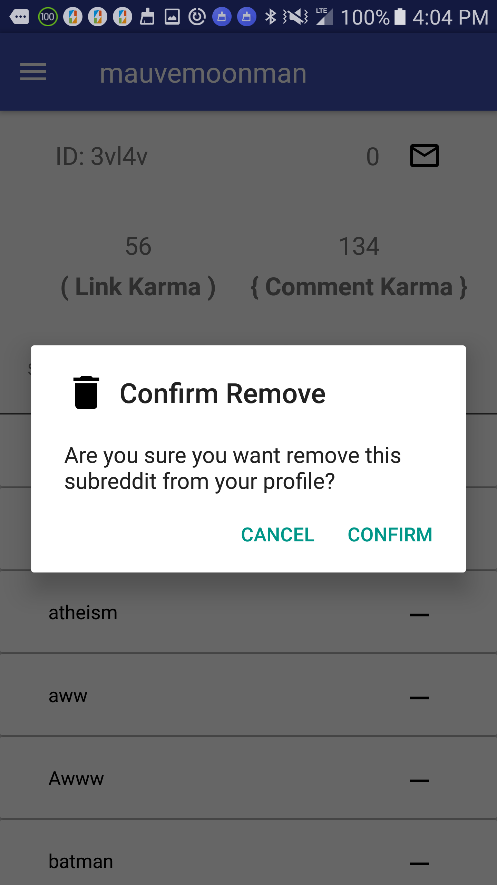

## RedShuffle

### Frameworks / Libraries
* Android Studio
* Volley
* Ion

### Description

Enjoy a near infinite source of topics and news at your fingertips! Simple and intuitive controls allow you to navigate through Reddit's vast collection of user generated content one click at a time. Users have the option to add to their favorite subreddits, and can even add those subreddits to their profile's list of subscriptions for later!

### Screens

#### license

MIT. Copyright (c) Brad Zimmerman
